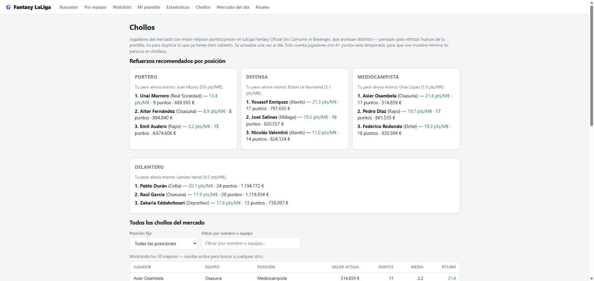
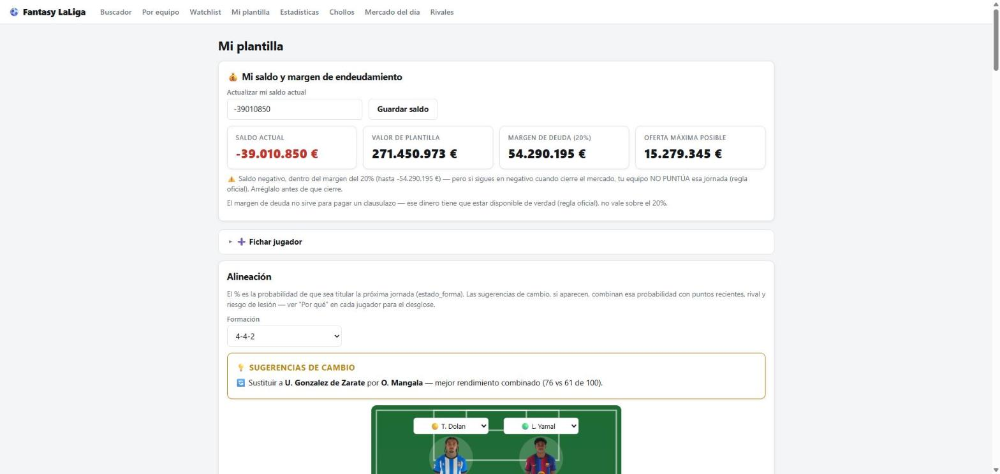
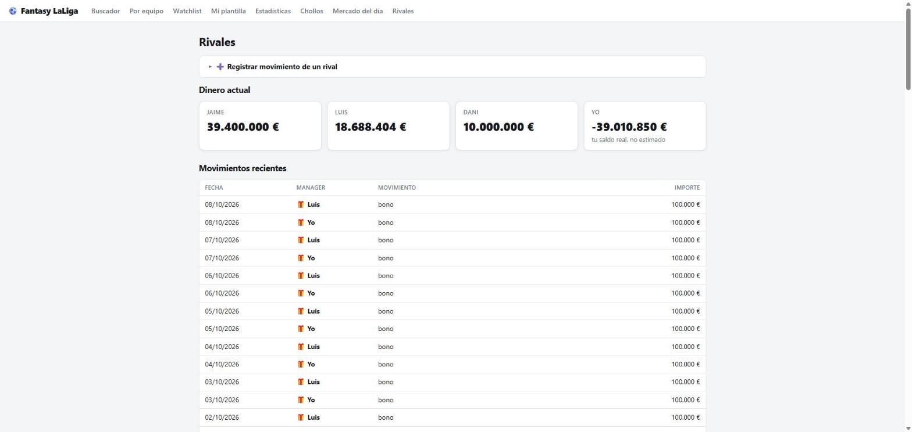
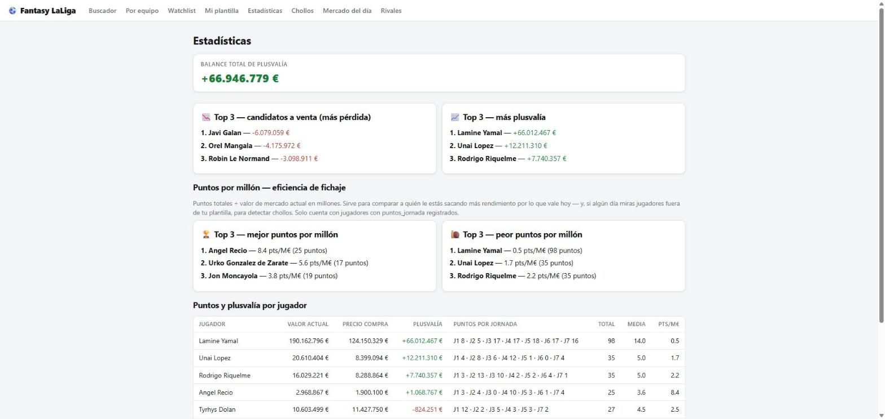
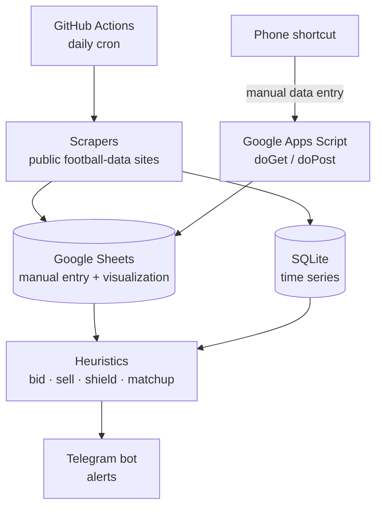

# Fantasy Football Decision Support

> A semi-automated decision-support system for a Spanish football fantasy game: it watches
> prices, the transfer market, opponents, and news, and sends alerts — the human still makes
> every move by hand, in the game's own app.

<p align="center">
  
  
  
</p>

> This is a cleaned-up extract of a personal side project. A reconnaissance phase explored
> whether the official app's private API could be used (it technically could — see below); the
> code for that was deliberately **excluded** from this repo along with everything that
> production system doesn't actually use.

## Problem → Solution → Result

**Problem.** The game has a daily rotating transfer market with sealed first-price bidding, a
release-clause mechanic any rival can trigger, and a shield that temporarily blocks it — and the
single most valuable signal (what rivals are actually buying, selling, and paying) isn't
available anywhere, isn't recoverable retroactively, and has to be captured as it happens.
Deciding *how much to bid*, *when to sell*, and *who to shield* by gut feeling leaves real value
on the table.

**Solution.** A pipeline that scrapes public football-data sites daily (prices, news, fixtures,
injuries/suspensions), stores it in Google Sheets (for manual entry from a phone) and SQLite (for
time series), and runs a small set of transparent heuristics against it: bid pricing based on
positional scarcity and recent price momentum, a sell/hold rule based on the expected 3-5 day
price trend rather than absolute price, and a shield-priority score that weights the release
clause discount by each rival's *inferred* available budget. Everything that matters gets pushed
to Telegram, so nothing depends on remembering to open a dashboard.

**Result.** Every recommendation returns a reasoned range and its justification, never a bare
number — deliberately, since early on there isn't enough observed data (real winning bids) to
calibrate a real model, and a heuristic that explains itself is more useful than a precise-looking
guess. The system is explicit about this: an ML model for bid overpricing is planned, but gated
behind having 40+ real observed bids first — "with fewer than 40 observations, a model is worse
than a heuristic" is a hard rule in the project, not a suggestion.

---

## Screenshots

The static dashboard that reads from this pipeline's data (not included in this repo — see
"What's not here" below):

| Bargain scouting | My squad |
|---|---|
|  |  |

| Rival activity feed | Player value stats |
|---|---|
|  |  |

## Why not the official app

The game's official mobile app has its own private API. A time-boxed reconnaissance session
(Android emulator + TLS proxy) confirmed it could technically be replicated from Python — down to
how its refresh tokens work. **That path was deliberately not taken for production.** The game's
terms of service prohibit automated access, and what's actually at risk is the account itself,
not a legal abstraction. The system instead relies entirely on low-frequency scraping of public
football-data websites (price trackers, news aggregators), respecting `robots.txt` and running
once a day — the same cadence a person checking a few sites by hand would produce, just
automated and consistent. **No bid, sale, or lineup is ever submitted automatically** — the
system only informs; a human executes every action by hand in the app.

## Architecture



### Key design decisions

| Decision | Why |
|---|---|
| **Scheduled compute on GitHub Actions, not a local machine** | The free 2,000 min/month tier is more than enough, and it doesn't depend on a personal computer being on |
| **Google Sheets as the entry/visualization layer** | Data gets entered by hand from a phone; a spreadsheet is the lowest-friction interface for that |
| **SQLite alongside Sheets** | Sheets doesn't hold up well for long time series; SQLite does |
| **Heuristics first, ML gated behind a data threshold** | Under ~40 real observations, a fitted model is *worse* than a transparent rule — the project treats this as a hard constraint, not a suggestion, with one explicit, documented exception |
| **Every estimate returns a range + a reason, never a bare number** | A decision support tool that hides its reasoning behind a single percentage invites misplaced trust in a heuristic that hasn't been validated yet |
| **Public scraping only, rate-limited to once a day** | The alternative (the official private API) works technically but risks the account under the game's terms of service — not worth it for a side project |
| **Every scraper/workflow failure alerts via Telegram** | A scraper that fails silently gets discovered weeks too late, after a market cycle is already lost |

## Decision modules

- **`puja.py`** — bid pricing. You're not bidding against the market value, you're bidding
  against your rivals; the quantity being modeled is the *overpay* (`winning_bid / market_value -
  1`), driven by positional scarcity and recent price momentum.
- **`venta.py`** — sell/hold. Sell when the expected 3-5 day price trend turns negative, not
  because a player is expensive — expensive and still rising means hold.
- **`blindaje.py`** — shield priority. `risk = (market_value - release_clause) × P(some rival has
  enough budget)`, with rival budgets inferred from observed league transfer history (falls back
  to a clearly-labeled default probability when there isn't enough history yet).
- **`chollos.py`** — bargain scouting: points-per-value ranking by position, with a minimum
  sample-size floor so a cheap player with one lucky match doesn't look like a steal.
- **`enfrentamientos.py`** — a transparent, manually-weighted (not statistically fitted) estimate
  of win probability for lineup decisions, combining head-to-head history, home advantage, recent
  form, league position, and injury/suspension news — always shown with its full signal breakdown,
  never just a percentage.

## Stack

Python 3.11+ · requests + BeautifulSoup (scraping) · pandas · gspread (Google Sheets) · SQLite ·
python-telegram (alerts) · Google Apps Script (mobile data entry bridge) · GitHub Actions
(scheduling)

## Running it

```bash
python -m venv .venv
source .venv/bin/activate  # or .venv\Scripts\Activate.ps1 on Windows
pip install -r requirements.txt
cp .env.example .env   # fill in your own Google Sheet, Telegram bot, etc.
```

Each ingestion script (`src/ingesta/scraper_*.py`) and alert module can be run standalone; in
production they're scheduled by the included GitHub Actions workflow.

## What's not here

- The API reconnaissance findings and the private API's endpoints — deliberately excluded (see
  "Why not the official app").
- The web dashboard's source code and the retired Streamlit app — front-end code, not the focus
  of this extract (the screenshots above show the dashboard; its code isn't published here).
- The live deployment URL and team badge assets.

The screenshots do show real data from my own private league (first names of friends I play
against, my own squad and balance) — nothing sensitive, just a casual game among friends.

## License

MIT — see [LICENSE](LICENSE).
